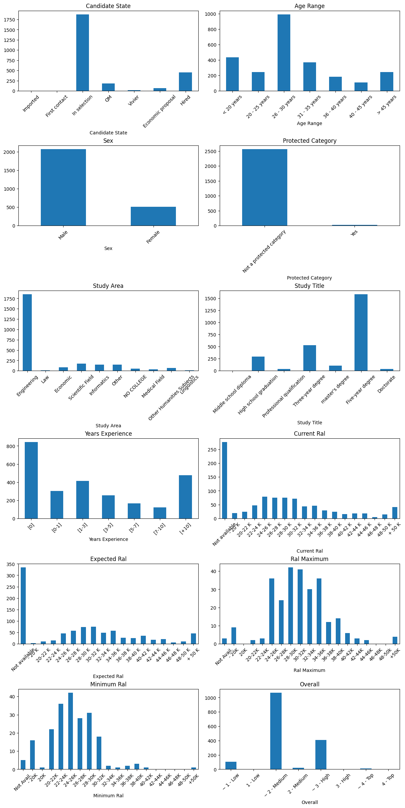
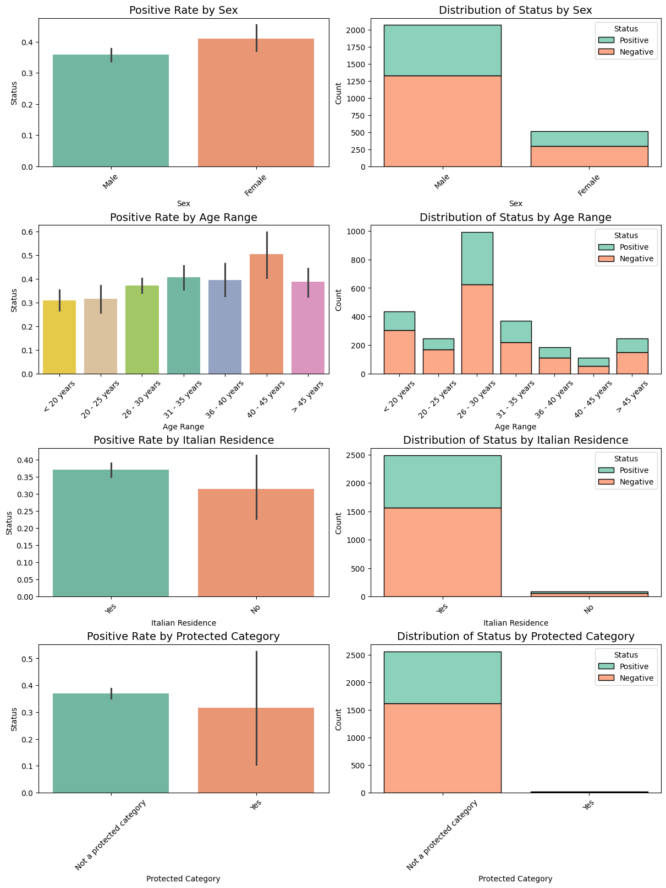
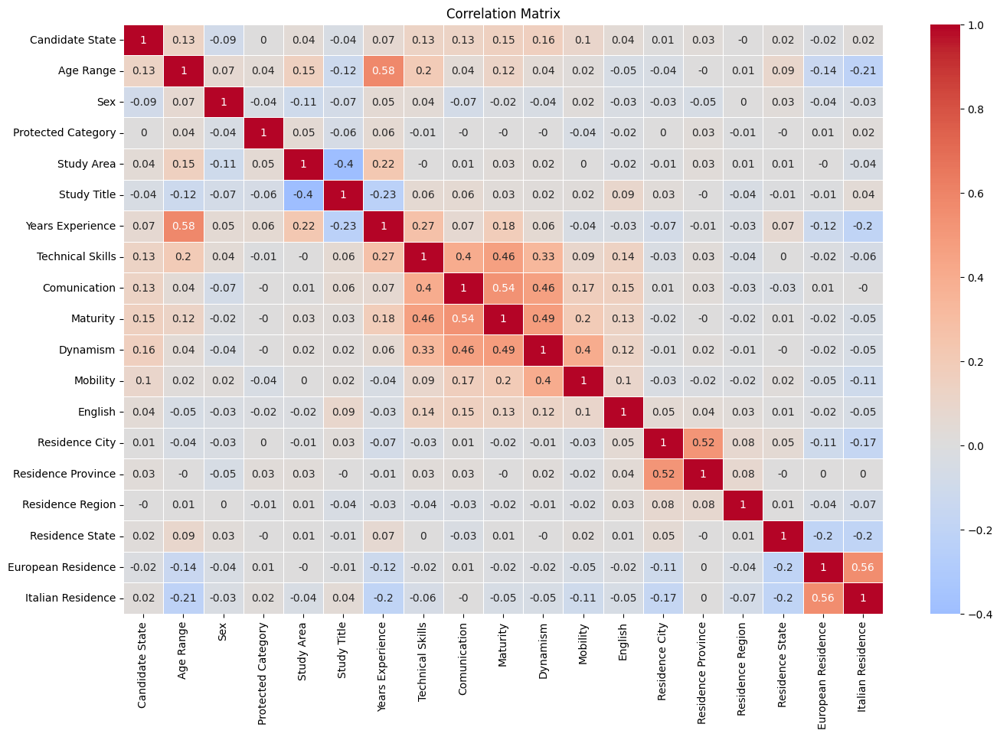
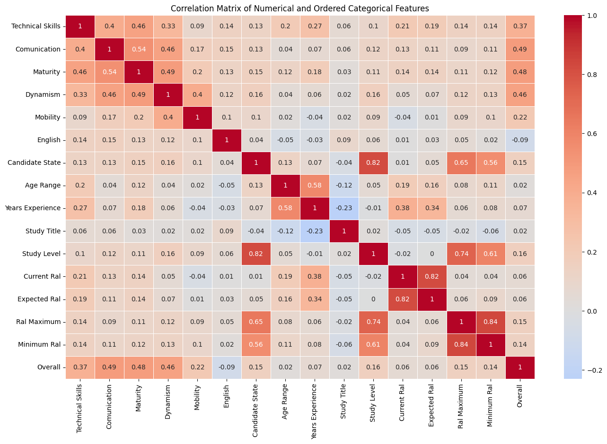
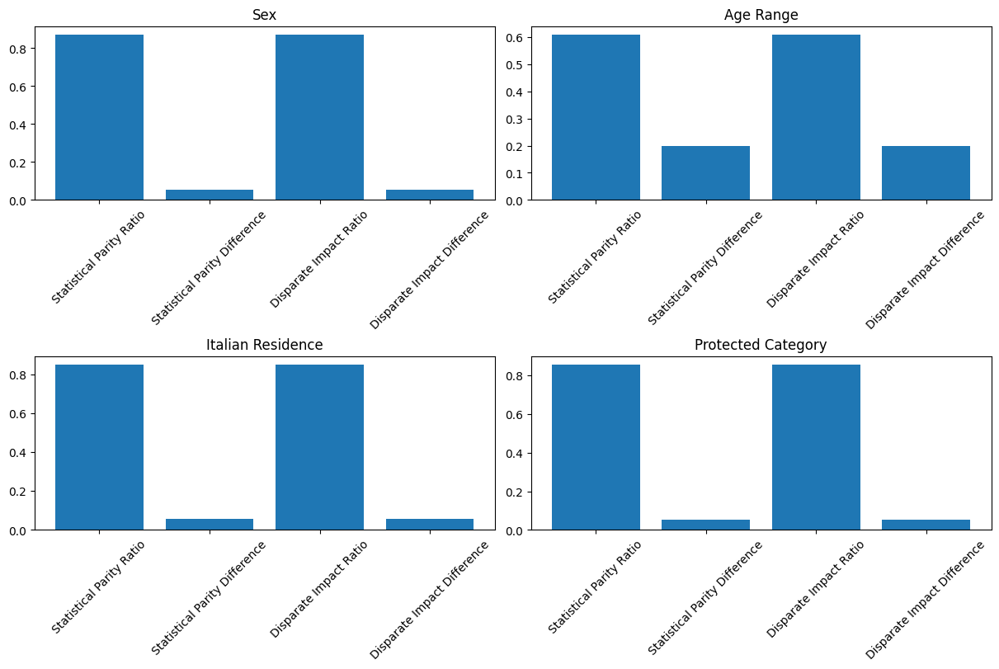
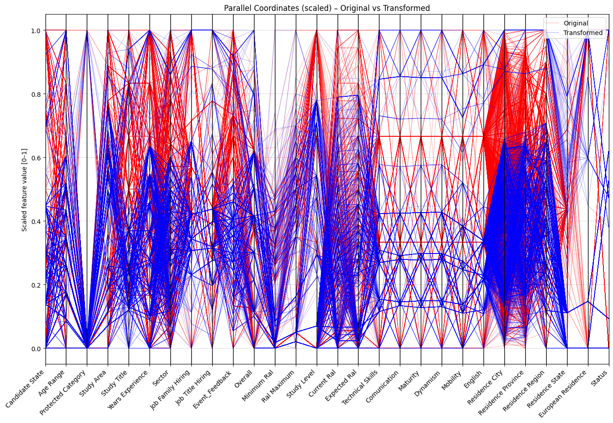
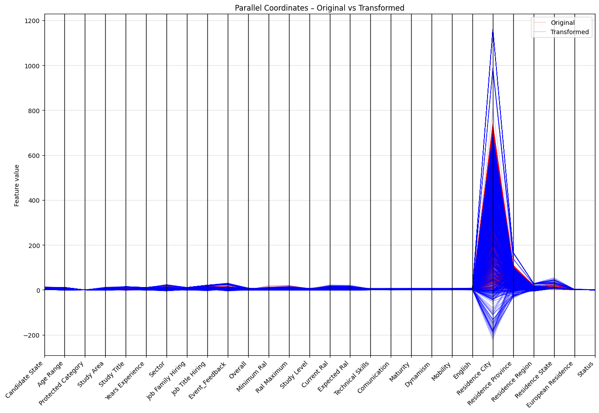
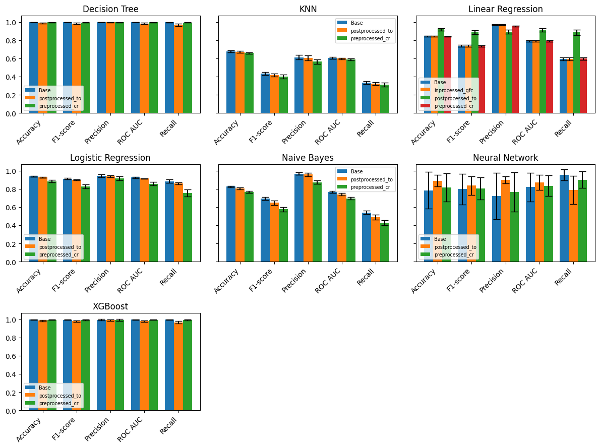
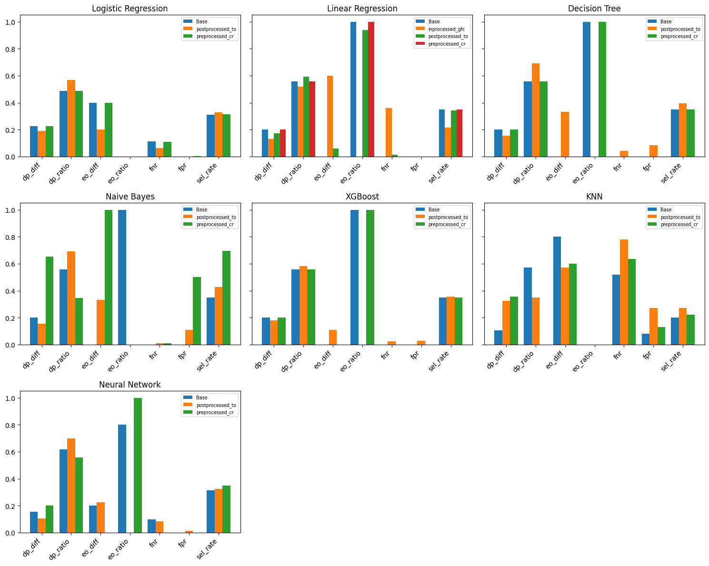

Fairness Pipeline Documentation
===============================
Akkodis è un’azienda globale che si occupa di consulenza e offre servizi di recruiting e formazione. Dal 2022 fa parte del gruppo Adecco, leader mondiale nel reclutamento di personale. L’azienda si distingue per il suo impegno verso l’inclusività.

**Struttura del Dataset**

Il dataset dell’azienda, precedentemente anonimizzato, presenta più righe per ciascun candidato memorizzato. Per ogni candidato, ogni riga identifica uno step diverso nel processo di recruiting. Le colonne possono essere suddivise in tre macrocategorie:

**ATTRIBUTI del CANDIDATO:**

- **ID**: Identificatore univoco.
- **Candidate State**: Stato del candidato:
    - **Imported**: Candidati importati da database esterni (es. AlmaLaurea). Alcuni potrebbero non aver mai risposto ad Akkodis. `Event_Type__Val = CV Request` indica che il recruiter non ha ancora ricevuto il curriculum.
    - **First contact**: Primi contatti (normalmente telefonici). Alcuni potrebbero aver interrotto i contatti o avere un curriculum inadeguato (`Event_Feedback = Inadequate CV`).
    - **In selection**: Candidati in fase di selezione, sottoposti ai primi colloqui per una posizione lavorativa.
    - **QM**: Candidati sottoposti a Qualification Meeting.
    - **Economic Proposal**: Candidati che hanno ricevuto una proposta economica.
    - **Vivier**: Candidati con competenze non allineate ai requisiti ma valide per opportunità future.
    - **Hired**: Candidato assunto dall’azienda cliente.
- **Age Range**: Range di età del candidato: [< 20], [20 – 25], [26 – 30], [31 – 35], [36 – 40], [40 – 45], [> 45] 
- **Residence**: Residenza attuale.
- **Sex**: Sesso del candidato (Male | Female, default: Male).
- **Protected Category**: Indica se il candidato appartiene a categorie protette (Art.1 e Art.18).
- **TAG**: Parole chiave utilizzate dal recruiter.
- **Study Area**: Disciplina accademica di studio.
- **Study Title**: Titolo accademico:
    - Middle school diploma
    - Professional qualification
    - High school graduation
    - Three-year degree
    - Five-year degree
    - Master’s degree
    - Doctorate
- **Years Experience**: Range di anni di esperienza: [0], [0-1], [1-3], [3-5], [5-7], [7-10], [+10] 
- **Sector**: Settore di esperienza.
- **Last Role**: Ultimo ruolo lavorativo o di studio.
- **Year of Insertion**: Anno di inserimento nel database.
- **Year of Recruitment**: Anno di assunzione (solo se `Candidate State = Hired`).
- **Current RAL**: Retribuzione attuale.
- **Expected RAL**: Aspettativa salariale.
 
**ATTRIBUTI del PROCESSO:** 

Sono relativi ad uno specifico stadio e cambiano per uno stesso candidato man mano che va avanti nel processo di recruiting.

- **Event_Type__Val**: Tipo di evento/stadio del processo:
    - **Iniziali**: Commercial note, CV Request, Contact note, Research Association.
    - **Centrali**: HR interview, BM interview, Technical interview, Qualification Meeting.
    - **Finali**: Candidate notification, Sending SC to customer, Economic proposal, Notify candidate, Inadequate CV.
- **Event_Feedback**: Feedback associato all’evento (OK o KO, con eventuali commenti).
- **Overall**: Punteggio del colloquio (solo per eventi centrali).
- **Akkodis Headquarters**: Sede di Akkodis che gestisce il candidato.
- Punteggi assegnati dal recruiter (1–4) durante il colloquio:
    - **Technical Skills**
    - **Standing/Position**
    - **Communication**
    - **Dynamism**
    - **Mobility**
    - **English**

**ATTRIBUTI della POSIZIONE LAVORATIVA:** 

Questi campi sono presenti solo se il candidato è stato assunto dalla azienda in questione. 

- **Recruitment Request**: Richiesta aziendale.
- **Assumption Headquarters**: Sede della posizione.
- **Job Family Hiring**: Categoria del ruolo.
- **Job Title Hiring**: Titolo del ruolo.
- **Job Description**: Descrizione del ruolo.
- **Candidate Profile**: Profilo ideale richiesto.
- **Years Experience.1**: Anni di esperienza richiesti (range compatibile con Years Experience del candidato).
- **Minimum RAL**: RAL minima prevista.
- **Maximum RAL**: RAL massima prevista.
- **Study Level**: Livello di studio richiesto (compatibile con Study Title).
- **Study Area.1**: Ambito di studio richiesto (compatibile con Study Area).
- **Linked_search_key**: Codice `RSnn.nnnn` (nn = anno di inserimento, nnnn = numero di ricerche).

1. Data Cleaning
-----------------
Carichiamo il dataset, rimuoviamo i duplicati, colonne inutili, righe non desiderate, e applichiamo il remapping definito nel file di configurazione.

.. code-block:: python

    PATH = 'C:/Users/andre/Desktop/ProjectWork_AEQUITAS_AKKODIS/'
    df = (
        pd.read_excel(PATH + 'data/Dataset_2.0_Akkodis.xlsx')
            .rename(columns=lambda c: c.lstrip().title())
    )
    df = df.drop_duplicates(subset='Id', keep='last')
    df = df.drop(columns=config['drop_columns'])

    for col, remove_list in config['drop_rows'].items():
        df = df[~df[col].isin(remove_list)]

    for col, mapping in config['remap_rows'].items():
        df[col] = df[col].replace(mapping)

.. code-block:: python

    unuseful_columns = []
    for col in df.columns:
        null_count = df[col].isna().sum() / df.shape[0]
        if null_count > (float(config['drop_nan_columns_threshold']) / 100):
            unuseful_columns.append(col)
    df = df.drop(columns=unuseful_columns)

    for col, filler in config['fill_nan_columns'].items():
        if filler == '%MEAN%':
            media = round(df[col].mean())
            df[col].fillna(media, inplace=True)
        else:
            df[col].fillna(filler, inplace=True)

**Feature Mapping**

.. code-block:: python

    def gen_lists(df, specs):
        out = {}
        for name, p in specs.items():
            base = out.get(p['src'], df[p['src']].dropna().astype(str).unique())
            items = [
                x for x in base
                if not any(exc in x for exc in p.get('exc', []))
                   and (any(inc in x for inc in p.get('inc', [])) if 'inc' in p else True)
            ]
            for key in ('split', 'post'):
                if key in p:
                    sep, idx = p[key]
                    items = [x.split(sep)[idx] if sep in x else x for x in items]
            out[name] = sorted(set(items))
        return out

    def apply_field(val, p, lists, feature_cfg):
        if 'list' in p:
            return next((x for x in lists[p['list']] if x in str(val)), p['def'])
        if 'in' in p:
            return p['y'] if val in feature_cfg[p['in']] else p['n']
        if 'eq' in p:
            return p['y'] if str(val) == p['eq'] else p['n']

    for feature, feat_cfg in config['feature_remapping'].items():
        lists = gen_lists(df, feat_cfg['lists'])
        for col_name, col_cfg in feat_cfg['fields'].items():
            df[col_name] = df[col_cfg['src']].apply(lambda v, cfg=col_cfg: apply_field(v, cfg, lists, feat_cfg))
        df = df.drop(columns=feature, errors='ignore')

2. Data Loading & Understanding
-------------------------------
2.1 Feature Selection
~~~~~~~~~~~~~~~~~~~~~

**Target Selection**

L’obiettivo del progetto è lo sviluppo di modelli di AI da impiegare nelle fasi preliminari del processo di recruiting per analizzare i bias emergenti. La scelta del target è stata influenzata dalla struttura del dataset, che contiene informazioni sui candidati e sulle posizioni gestite da Akkodis.
In base ai dati disponibili, sono stati identificati due possibili obiettivi di predizione automatica:

- **RAL**
    Predire la RAL più adeguata al profilo del candidato.
- **Status**
    Etichettare la coppia candidato-posizione come positiva o negativa, definendo se il profilo del candidato sia adeguato alle richieste aziendali.
    In particolare, un candidato viene considerato Positive se risulta in una delle situazioni seguenti:
    
    - Il suo Candidate State indica che è stato assunto (Hired), ha ricevuto un’offerta economica (Economic proposal) oppure è arrivato al Qualification Meeting (QM), fase chiave di valutazione avanzata.
    - Il suo ultimo Event_Feedback riporta un riscontro positivo, come un feedback tecnico in diretta (OK (live)), la conferma dell’inizio imminente dell’attività (OK (waiting for departure)) o la conferma esplicita di assunzione (OK (hired)).
    - In qualsiasi altro caso, il profilo viene etichettato Negative, segnalando che non ha soddisfatto i requisiti aziendali a livelli decisionali rilevanti.

La prima ipotesi è stata scartata poiché oltre il 90% dei candidati non presenta valori per i campi relativi alla RAL.
Per distinguere tra candidati idonei e non idonei, è necessario definire una variabile target esplicita, tuttavia il dataset originale non contiene una colonna binaria per questo scopo.
Pertanto è stata creata la variabile Status, derivata logicamente, in base ai criteri appena mostrati, dalle colonne Candidate State ed Event_Feedback.
Questa scelta è coerente con l’obiettivo di valutare se i modelli di classificazione rispettino criteri di equità nel processo decisionale di assunzione.

.. code-block:: python

    mask = np.zeros(len(df), dtype=bool)
    for col, valid_values in config['status_positive_conditions'].items():
        mask |= df[col].isin(valid_values)
    df['Status'] = np.where(mask, 'Positive', 'Negative')

**Feature Statistics**

.. code-block:: python

    stats = pd.DataFrame(index=df.columns)
    stats['missing_values'] = df.isnull().sum()
    stats['min'] = df.min(numeric_only=True)
    stats['max'] = df.max(numeric_only=True)
    stats['mean'] = df.mean(numeric_only=True)
    stats['std'] = df.std(numeric_only=True)
    stats['1st_percentile'] = df.quantile(0.25, numeric_only=True)
    stats['2nd_percentile'] = df.quantile(0.50, numeric_only=True)
    stats['3rd_percentile'] = df.quantile(0.75, numeric_only=True)
    stats['type'] = df.dtypes
    stats['distinct_values'] = df.nunique()

.. code-block:: text

    | Column             | missing_values | min | max |     mean |      std | 1st_percentile | 2nd_percentile | 3rd_percentile |    type | distinct_values |
    | ------------------ | -------------: | --: | --: | -------: | -------: | -------------: | -------------: | -------------: | ------: | --------------: |
    | Candidate State    |              0 | NaN | NaN |      NaN |      NaN |            NaN |            NaN |            NaN |  object |               5 |
    | Age Range          |              0 | NaN | NaN |      NaN |      NaN |            NaN |            NaN |            NaN |  object |               7 |
    | Sex                |              0 | NaN | NaN |      NaN |      NaN |            NaN |            NaN |            NaN |  object |               2 |
    | Protected Category |              0 | NaN | NaN |      NaN |      NaN |            NaN |            NaN |            NaN |  object |               2 |
    | Study Area         |              0 | NaN | NaN |      NaN |      NaN |            NaN |            NaN |            NaN |  object |              10 |
    | Study Title        |              0 | NaN | NaN |      NaN |      NaN |            NaN |            NaN |            NaN |  object |               7 |
    | Years Experience   |              0 | NaN | NaN |      NaN |      NaN |            NaN |            NaN |            NaN |  object |               7 |
    | Sector             |            217 | NaN | NaN |      NaN |      NaN |            NaN |            NaN |            NaN |  object |              14 |
    | Job Family Hiring  |          2 137 | NaN | NaN |      NaN |      NaN |            NaN |            NaN |            NaN |  object |               7 |
    | Job Title Hiring   |          2 137 | NaN | NaN |      NaN |      NaN |            NaN |            NaN |            NaN |  object |              18 |
    | Event\_Feedback    |            932 | NaN | NaN |      NaN |      NaN |            NaN |            NaN |            NaN |  object |              15 |
    | Overall            |            964 | NaN | NaN |      NaN |      NaN |            NaN |            NaN |            NaN |  object |               8 |
    | Minimum Ral        |          2 373 | NaN | NaN |      NaN |      NaN |            NaN |            NaN |            NaN |  object |              15 |
    | Ral Maximum        |          2 310 | NaN | NaN |      NaN |      NaN |            NaN |            NaN |            NaN |  object |              17 |
    | Study Level        |          2 198 | NaN | NaN |      NaN |      NaN |            NaN |            NaN |            NaN |  object |               7 |
    | Current Ral        |          1 660 | NaN | NaN |      NaN |      NaN |            NaN |            NaN |            NaN |  object |              18 |
    | Expected Ral       |          1 668 | NaN | NaN |      NaN |      NaN |            NaN |            NaN |            NaN |  object |              18 |
    | Technical Skills   |            972 | 1.0 | 4.0 | 2.139130 | 0.648580 |            2.0 |            2.0 |            3.0 | float64 |               4 |
    | Comunication       |            972 | 1.0 | 4.0 | 2.274534 | 0.617064 |            2.0 |            2.0 |            3.0 | float64 |               4 |
    | Maturity           |            969 | 1.0 | 4.0 | 2.262244 | 0.600904 |            2.0 |            2.0 |            3.0 | float64 |               4 |
    | Dynamism           |            969 | 1.0 | 4.0 | 2.260384 | 0.602228 |            2.0 |            2.0 |            3.0 | float64 |               4 |
    | Mobility           |            968 | 1.0 | 4.0 | 2.163569 | 0.823108 |            2.0 |            2.0 |            3.0 | float64 |               4 |
    | English            |            972 | 1.0 | 4.0 | 2.759006 | 0.543047 |            3.0 |            3.0 |            3.0 | float64 |               4 |
    | Residence City     |              0 | NaN | NaN |      NaN |      NaN |            NaN |            NaN |            NaN |  object |             741 |
    | Residence Province |              0 | NaN | NaN |      NaN |      NaN |            NaN |            NaN |            NaN |  object |             112 |
    | Residence Region   |              0 | NaN | NaN |      NaN |      NaN |            NaN |            NaN |            NaN |  object |              21 |
    | Residence State    |              0 | NaN | NaN |      NaN |      NaN |            NaN |            NaN |            NaN |  object |              33 |
    | European Residence |              0 | NaN | NaN |      NaN |      NaN |            NaN |            NaN |            NaN |  object |               2 |
    | Italian Residence  |              0 | NaN | NaN |      NaN |      NaN |            NaN |            NaN |            NaN |  object |               2 |
    | Status             |              0 | NaN | NaN |      NaN |      NaN |            NaN |            NaN |            NaN |  object |               2 |

.. code-block:: python

    cols = 2  # numero di colonne nella griglia
    n = len(config['visualize_columns'])
    rows = math.ceil(n / cols)

    fig, axes = plt.subplots(rows, cols, figsize=(cols*6, rows*4), constrained_layout=True)
    axes = axes.flatten()
    for i, lookup in enumerate(config['visualize_columns']):
        ax = axes[i]

        distrib = Counter(df[lookup])
        labels = config['categorical_columns_custom_orders'].get(lookup, list(distrib.keys()))
        counts = [distrib[label] for label in labels]
        distrib_df = pd.DataFrame({lookup: labels, 'Count': counts})

        distrib_df.plot(
            x=lookup,
            y='Count',
            kind='bar',
            legend=False,
            ax=ax
        )
        ax.set_title(lookup)
        ax.tick_params(axis='x', rotation=45)  # se vuoi ruotare le etichette

    for j in range(i+1, len(axes)):
        axes[j].axis('off')

    plt.show()

**Sensitive Feature Selection**

Nel contesto dell’analisi di equità algoritmica, le variabili considerate sensibili sono state individuate sulla base di criteri normativi (es. GDPR) e di rilevanza sociale, con l’obiettivo di monitorarne l’impatto sui tassi di assunzione e prevenire possibili discriminazioni. In particolare, sono state studiate le seguenti caratteristiche protette:

- **Sesso (Gender)**
    Il dataset presenta una marcata sottorappresentazione delle candidate di sesso femminile (20% del totale). Tuttavia, il tasso di assunzione delle donne risulta superiore a quello degli uomini: l’8,3% contro il 5,3%. Questa differenza potrebbe riflettere una scelta organizzativa volta a incrementare la diversità di genere, oppure la maggiore qualificazione dei profili femminili.
- **Fascia di età (Age Range)**
    Più del 65% dei candidati ha meno di 30 anni, di cui il 17% addirittura sotto i 20. Tuttavia, i tassi di assunzione crescono nelle fasce più mature, con un picco tra 31 e 45 anni, a conferma di una preferenza verso professionisti con maggiore esperienza. I candidati più giovani (≤ 26 anni) mostrano performance di assunzione complessivamente inferiori.
- **Residenza italiana**
    I candidati con residenza in Italia mostrano una probabilità di assunzione più elevata, probabilmente a causa di fattori logistici, vincoli normativi e della presenza di uffici locali.
    Tuttavia, il numero di non residenti nel nostro campione è esiguo, rendendo impossibile trarre conclusioni significative sul loro tasso di assunzione. Durante la fase successiva di raccolta dati, sarà dunque essenziale aumentare la rappresentatività di questo gruppo per analizzare eventuali disparità.
- **Categoria protetta (Protected Category)**
    Gli appartenenti alle categorie protette costituiscono solo lo 0,6 % del campione (18 candidati), un’incidenza troppo bassa per consentire valutazioni statistiche affidabili sul loro esito di selezione. Per stabilire se esistano discriminazioni o differenze sostanziali, anche in questo caso risulta fondamentale aumentare la rappresentatività del gruppo per effettuare una analisi adeguata sulle possibili disparità.

Il passo successivo consisterà nell’integrare queste valutazioni all’interno del flusso di sviluppo del modello di selezione, applicando metriche di fairness e strumenti di mitigazione per garantire un processo di assunzione equo e trasparente.

.. code-block:: python

    cols = 2  # numero di colonne nella griglia
    n = len(config['sensitive_columns'])
    total_plots = n * 2
    rows = math.ceil(total_plots / cols)

    fig, axes = plt.subplots(rows, cols, figsize=(cols*6, rows*4), constrained_layout=True)
    axes = axes.flatten()
    for i, snstv_col in enumerate(config['sensitive_columns']):
        order = config['categorical_columns_custom_orders'].get(snstv_col, None)

        df_plot = df.copy()
        if order:
            df_plot[snstv_col] = pd.Categorical(
                df_plot[snstv_col],
                categories=order,
                ordered=True
            )

        ax_hist = axes[2 * i + 1]
        sns.histplot(
            data=df_plot,
            x=snstv_col,
            hue="Status",
            multiple="stack",
            palette="Set2",
            shrink=0.8,
            ax=ax_hist
        )
        ax_hist.set_title(f"Distribution of Status by {snstv_col}", fontsize=14)
        ax_hist.tick_params(axis='x', rotation=45)

        
        ax_bar = axes[2 * i]
        sns.barplot(
            data=df,
            x=snstv_col,
            y=(df['Status'] == 'Positive').astype(float),
            estimator=np.mean,
            order=order,
            hue=snstv_col,
            palette='Set2',
            ax=ax_bar
        )
        ax_bar.set_title(f"Positive Rate by {snstv_col}", fontsize=14)
        ax_bar.tick_params(axis='x', rotation=45)

    for j in range(2 * n, len(axes)):
        axes[j].axis('off')

    plt.show()

2.2 Proxy Identification
~~~~~~~~~~~~~~~~~~~~~~~~

**Cross-Correlation Analysis**

Per evidenziare le relazioni tra le colonne del dataset e ottenere una rappresentazione grafica riassuntiva è stata generata una matrice di correlazione, utilizzando la funzione heatmap di Seaborn

.. code-block:: python

    columns_type = {}
    for col in df.columns:
        if pd.api.types.is_string_dtype(df[col]):
            columns_type[col] = 'cat'
        elif pd.api.types.is_numeric_dtype(df[col]):
            columns_type[col] = 'num'

    encoding_mappings = {}
    df_corr = pd.DataFrame(index=df.index)
    for col, t in columns_type.items():
        if t == 'cat':
            if col in config['categorical_columns_custom_orders']:
                ordered = config['categorical_columns_custom_orders'][col]
                df_corr[col] = pd.Categorical(df[col], categories=ordered, ordered=True).codes
                encoding_mappings[col] = {cat: i for i, cat in enumerate(ordered)}
            else:
                encoder = LabelEncoder()
                df_corr[col] = encoder.fit_transform(df[col].astype(str))
                encoding_mappings[col] = dict(zip(encoder.classes_, encoder.transform(encoder.classes_)))
        else:
            df_corr[col] = df[col]

    plt.figure(figsize=(16, 10))
    sns.heatmap(df_corr.corr().round(2), annot=True, cmap='coolwarm', center=0, linewidths=.5)
    plt.title("Correlation Matrix")

.. code-block:: python

    df_num = df.select_dtypes(include='number')

    cat_cols = list(config['categorical_columns_custom_orders'].keys())

    df_cat_encoded = pd.DataFrame(
        { col: pd.Categorical(df[col],
                            categories=config['categorical_columns_custom_orders'][col],
                            ordered=True
                            ).codes
        for col in cat_cols },
        index=df.index
    )

    df_corr = pd.concat([df_num, df_cat_encoded], axis=1)

    plt.figure(figsize=(16, 10))
    sns.heatmap(df_corr.corr().round(2), annot=True, cmap='coolwarm', center=0, linewidths=.5)
    plt.title("Correlation Matrix of Numerical and Ordered Categorical Features")

.. code-block:: python

    corr_matrix = df_corr.corr().abs()

    # Create a mask to get the upper triangle (excluding the diagonal)
    upper_triangle_mask = np.triu(np.ones_like(corr_matrix, dtype=bool), k=1)
    upper_triangle = corr_matrix.where(upper_triangle_mask)
    corr_pairs = upper_triangle.stack()

    high_corr_pairs = corr_pairs[corr_pairs > config['correlation_threshold']].sort_values(ascending=False)

    print("Variable pairs with correlation above the threshold:")
    print(high_corr_pairs)

.. code-block:: text

    Variable pairs with correlation above the threshold:
    Ral Maximum      Minimum Ral     0.839071
    Candidate State  Study Level     0.822850
    Current Ral      Expected Ral    0.818242
    Study Level      Ral Maximum     0.736592
    dtype: float64

**Chi-squared Test Analysis**

Per identificare le variabili categoriche che potrebbero essere considerate proxy per le feature sensibili, è stata effettuata un’analisi basata sul test del chi-squared.

.. code-block:: python

    columns_type = {}
    for col in df.columns:
        if pd.api.types.is_string_dtype(df[col]):
            columns_type[col] = 'cat'
        elif pd.api.types.is_numeric_dtype(df[col]):
            columns_type[col] = 'num'

    def compute(col1, col2):
        order = config['categorical_columns_custom_orders'].get(col1, None)
        contingency = pd.crosstab(df[col1], df[col2])
        if order:
            contingency = contingency.reindex(index=order)
        chi2, p, dof, expected = chi2_contingency(contingency, correction=False)
        test_name = 'Chi-squared'
        if contingency.shape == (2, 2) and (expected < 5).any():
            _, p = fisher_exact(contingency)
            test_name = "Fisher's exact"
        n = contingency.values.sum()
        k = min(contingency.shape)
        cramer_v = np.sqrt(chi2 / (n * (k - 1)))

        return contingency, expected, chi2, p, dof, cramer_v, test_name

    results = []
    cats = [col for col, t in columns_type.items() if t == 'cat']

    for col1, col2 in combinations(cats, 2):
        # Skip cause Residence attributes are highly correlated within themselves
        if 'Residence' in col1 or 'Residence' in col2:
            continue
        
        contingency, expected, chi2, p_raw, dof, cramer_v, test_name = compute(col1, col2)
        results.append({
            'col1':     col1,
            'col2':     col2,
            'chi2':     chi2,
            'p_raw':    p_raw,
            'dof':      dof,
            'cramer_v': cramer_v,
            'test':     test_name
        })
    res_df = pd.DataFrame(results)

    # Correzione Bonferroni su tutti i p_raw
    reject, p_bonf, _, _ = multipletests(res_df['p_raw'], method='bonferroni')
    res_df['p_bonf']      = p_bonf
    res_df['significant'] = reject

    thr_p = config['chi_squared_p_value_threshold']
    thr_v = config['cramers_v_threshold']
    mask = (res_df['p_bonf'] < thr_p) & (res_df['cramer_v'] >= thr_v)

    for _, row in res_df[mask].sort_values('cramer_v', ascending=False).iterrows():
        print(f"--- {row['col1']} vs {row['col2']} ---")
        print(f"{row['test']} test: "
            f"χ² = {row['chi2']:.2f}, "
            f"p (raw) = {row['p_raw']:.3e}, "
            f"p (Bonf.) = {row['p_bonf']:.3e}, "
            f"dof = {row['dof']}, "
            f"Cramér’s V = {row['cramer_v']:.3f}")
        print()

.. code-block:: text

    --- Age Range vs Years Experience ---
    Chi-squared test: χ² = 2092.78, p (raw) = 0.000e+00, p (Bonf.) = 0.000e+00, dof = 36, Cramér’s V = 0.368

    --- Study Area vs Study Title ---
    Chi-squared test: χ² = 1632.05, p (raw) = 5.224e-306, p (Bonf.) = 1.097e-304, dof = 54, Cramér’s V = 0.325

    --- Sex vs Study Area ---
    Chi-squared test: χ² = 214.75, p (raw) = 2.652e-41, p (Bonf.) = 5.570e-40, dof = 9, Cramér’s V = 0.288

2.3 Bias Detection
~~~~~~~~~~~~~~~~~~
Per valutare il livello di Fairness dei modelli addestrati sono state scelte tre metriche: 

- **Demographic Parity**
    Questa metrica richiede che ciascun gruppo abbia le stesse opportunità di essere assegnato alla classe positiva, indipendentemente da veri o falsi positivi. Un modello accurato potrebbe risultare unfair se i sottogruppi nel test set sono sbilanciati rispetto alla variabile target Status.
- **Equalized Odds**
    Questa metrica garantisce che i tassi di True Positive Rate (TPR) e False Positive Rate (FPR) siano costanti tra i diversi gruppi. Significa che il modello dovrebbe classificare erroneamente candidati non idonei come positivi con uguale probabilità per tutte le categorie, evitando di favorire o penalizzare un particolare sottoinsieme.

.. code-block:: python

    cols = 2
    n = len(config['sensitive_columns'])
    rows = math.ceil(n / cols)

    fig, axes = plt.subplots(rows, cols, figsize=(cols*6, rows*4), constrained_layout=True)
    axes = axes.flatten()

    for i, sensitive_attr in enumerate(config['sensitive_columns']):
        y_true = (df["Status"] == 'Positive').astype(int)
        y_pred = y_true  # Measuring bias in the true labels
        s_attr = df[sensitive_attr]

        dpr = demographic_parity_ratio(y_true, y_pred, sensitive_features=s_attr)
        dpd = demographic_parity_difference(y_true, y_pred, sensitive_features=s_attr)

        mf = MetricFrame(
            metrics=selection_rate,
            y_true=y_true,
            y_pred=y_pred,
            sensitive_features=s_attr
        )
        sr_by_group = mf.by_group

        dir = sr_by_group.min() / sr_by_group.max()
        did = sr_by_group.max() - sr_by_group.min()

        # Plot dei 4 valori
        metrics = [dpr, dpd, dir, did]
        labels = ['Statistical Parity Ratio',
                'Statistical Parity Difference',
                'Disparate Impact Ratio',
                'Disparate Impact Difference']
        
        ax = axes[i]
        ax.bar(labels, metrics)
        ax.set_title(sensitive_attr)
        ax.tick_params(axis='x', rotation=45)

    for j in range(i+1, len(axes)):
        axes[j].axis('off')

    plt.show()

3. Training and Testing
-----------------------

**Dataset Categorical Attributes Sorting and Encoding**

.. code-block:: python

    columns_type = {}
    for col in df.columns:
        if pd.api.types.is_string_dtype(df[col]):
            columns_type[col] = 'cat'
        elif pd.api.types.is_numeric_dtype(df[col]):
            columns_type[col] = 'num'

    encoding_mappings = {}
    df_corr = pd.DataFrame(index=df.index)
    for col, t in columns_type.items():
        if t == 'cat':
            if col in config['categorical_columns_custom_orders']:
                ordered = config['categorical_columns_custom_orders'][col]
                df_corr[col] = pd.Categorical(df[col], categories=ordered, ordered=True).codes
                encoding_mappings[col] = {cat: i for i, cat in enumerate(ordered)}
            else:
                encoder = LabelEncoder()
                df_corr[col] = encoder.fit_transform(df[col].astype(str))
                encoding_mappings[col] = dict(zip(encoder.classes_, encoder.transform(encoder.classes_)))
        else:
            df_corr[col] = df[col]

**Models**

Per  garantire  una  panoramica  complessiva  sono  stati  selezionati  modelli  appartenenti  a 
famiglie  algoritmiche  diverse,  includendo  modelli  lineari,  probabilistici,  ad  albero  e  reti 
neurali. L’obiettivo è confrontare i risultati e mettere in relazione performance e fairness. 
I modelli selezionati includono: 

- **Modelli Lineari** 
    - Linear Regression 
    - Logistic Regression 
- **Modelli Probabilistici** 
    - Gaussian Naïve Bayes 
- **Modelli Tree-based** 
    - Decision Tree
- **Modelli Distance-based** 
    - K-Nearest Neighbors 
- **Rete Neurale**
 
3.1 Pre-processing Mitigation
~~~~~~~~~~~~~~~~~~~~~~~~~~~~~

**Pre-processing**

.. code-block:: python

    cr = CorrelationRemover(sensitive_feature_ids=sensitive, alpha=1)

    X_train_cr = cr.fit_transform(train_df)
    X_train_cr_df = pd.DataFrame(X_train_cr)

    X_test_cr = cr.transform(test_df)
    X_test_cr_df = pd.DataFrame(X_test_cr)

**Normalized Coordinate Plot - Original Vs Transformed Dataset**

.. code-block:: python

    X_orig_df = X_train_split.copy()
    X_orig_df.drop(columns=sensitive, inplace=True)
    X_trans_df = X_train_cr_df.copy()

    scaler = MinMaxScaler()
    X_orig_df_scaled = pd.DataFrame(
        scaler.fit_transform(X_orig_df),
        columns=X_orig_df.columns,
        index=X_orig_df.index
    )
    X_trans_df_scaled = pd.DataFrame(
        scaler.fit_transform(X_trans_df),
        columns=X_trans_df.columns,
        index=X_trans_df.index
    )

    X_trans_df_scaled.columns = X_orig_df_scaled.columns
    X_orig_df_scaled['version'] = 'Original'
    X_trans_df_scaled['version'] = 'Transformed'

    df_combined_scaled = pd.concat(
        [X_orig_df_scaled, X_trans_df_scaled],
        ignore_index=True
    )

    plt.figure(figsize=(16, 10))
    parallel_coordinates(
        df_combined_scaled,
        class_column='version',
        cols=list(X_orig_df.columns),
        color=['red', 'blue'],
        alpha=0.3,
        linewidth=0.7
    )

    plt.title("Parallel Coordinates (scaled) – Original vs Transformed")
    plt.xticks(rotation=45, ha='right')
    plt.ylabel("Scaled feature value [0–1]")
    plt.grid(axis='y', linestyle='--', linewidth=0.5)

**Coordinate Plot - Original Vs Transformed Dataset**

.. code-block:: python
    
    X_orig_df = X_train_split.copy()
    X_orig_df.drop(columns=sensitive, inplace=True)
    X_trans_df = X_train_cr_df.copy()

    X_trans_df.columns = X_orig_df.columns  # Ensure same columns for comparison
    X_orig_df['version'] = 'Original'
    X_trans_df['version'] = 'Transformed'

    df_combined = pd.concat([X_orig_df, X_trans_df], ignore_index=True)

    plt.figure(figsize=(16, 10))
    parallel_coordinates(
        df_combined,
        class_column='version',
        cols= df_combined.columns[:-1],  # Exclude 'version' column
        color=['red', 'blue'],      # Original→red, Transformed→blue
        alpha=0.3,                  # transparency to see overlap
        linewidth=0.7
    )

    plt.title("Parallel Coordinates – Original vs Transformed")
    plt.xticks(rotation=45, ha='right')
    plt.ylabel("Feature value")
    plt.grid(axis='y', linestyle='--', linewidth=0.5)  # light horizontal grid

**Models**

.. code-block:: python

    def create_model(seed, input_dim):
        tf.random.set_seed(seed)
        model = Sequential()
        model.add(Dense(128, input_dim=input_dim, activation='relu'))
        model.add(BatchNormalization())
        model.add(Dense(128, activation='relu'))
        model.add(BatchNormalization())
        model.add(Dense(128, activation='relu'))
        model.add(BatchNormalization())
        model.add(Dense(64, activation='relu'))
        model.add(BatchNormalization())
        model.add(Dense(1, activation='sigmoid'))

        model.compile(optimizer='adam', loss='binary_crossentropy', metrics=['accuracy'])
        return model

    models = {
        'Logistic Regression': LogisticRegression(),
        'Linear Regression': LinearRegression(),
        'Decision Tree': DecisionTreeClassifier(),
        'Naive Bayes': GaussianNB(),
        'XGBoost': XGBClassifier(),
        'KNN': KNeighborsClassifier(),
        'Neural Network': create_model(random_seed, X_train_cr_df.shape[1]),
    }

**Training**

.. code-block:: python

    for model_name, model in models.items():
        print(f"Training {model_name}...")
        if model_name == 'Neural Network':
            model.fit(X_train_cr_df, y_train_split, epochs=10, batch_size=32, verbose=0)
            predictions[f"{model_name}_preprocessed_cr"] = model.predict(X_test_cr_df).flatten()
        else:
            model.fit(X_train_cr_df, y_train_split)
            predictions[f"{model_name}_preprocessed_cr"] = model.predict(X_test_cr_df)

        if model_name in ['Linear Regression', 'XGBoost', 'Neural Network']:
            predictions[f"{model_name}_preprocessed_cr"] = (predictions[f"{model_name}_preprocessed_cr"] > 0.5).astype(int)
        
        print(f"{model_name} trained.")
        temp = predictions[f"{model_name}_preprocessed_cr"]
        print(f"Preprocessed predictions for {model_name}: {temp}")
    
3.2 In-processing Mitigation
~~~~~~~~~~~~~~~~~~~~~~~~~~~~

**Models**

.. code-block:: python

    models = {
        'Linear Regression': LinearRegression(),
    }

**In-processing and Training**

.. code-block:: python

    for model_name, model in models.items():
        gfc = GerryFairClassifier(
            C=10,
            gamma=0.01,
            fairness_def='FP',
            max_iters=10,
            printflag=False,
            heatmapflag=False,
            heatmap_iter=10,
            heatmap_path='.',
            predictor=model
        )
        gfc.fit(train_ds)
        pred_gfc = gfc.predict(test_ds)
        predictions[f"{model_name}_inprocessed_gfc"] = pred_gfc.labels.ravel()
        temp = predictions[f"{model_name}_inprocessed_gfc"]
        print(f"Inprocessed predictions for {model_name}: {temp}")

3.3 Post-processing Mitigation
~~~~~~~~~~~~~~~~~~~~~~~~~~~~~~

**Models**

.. code-block:: python

    def create_model(seed, input_dim):
        tf.random.set_seed(seed)
        model = Sequential()
        model.add(Dense(128, input_dim=input_dim, activation='relu'))
        model.add(BatchNormalization())
        model.add(Dense(128, activation='relu'))
        model.add(BatchNormalization())
        model.add(Dense(128, activation='relu'))
        model.add(BatchNormalization())
        model.add(Dense(64, activation='relu'))
        model.add(BatchNormalization())
        model.add(Dense(1, activation='sigmoid'))

        model.compile(optimizer='adam', loss='binary_crossentropy', metrics=['accuracy'])
        return model

    models = {
        'Logistic Regression': LogisticRegression(),
        'Linear Regression': LinearRegression(),
        'Decision Tree': DecisionTreeClassifier(),
        'Naive Bayes': GaussianNB(),
        'XGBoost': XGBClassifier(),
        'KNN': KNeighborsClassifier(),
        'Neural Network': create_model(random_seed, train_df.shape[1]),
    }

**Training**

.. code-block:: python

    for model_name, model in models.items():
        print(f"Training {model_name}...")
        if model_name == 'Neural Network':
            model.fit(train_df, y_train_split, epochs=10, batch_size=32, verbose=0)
            predictions[f"{model_name}_postprocessed_to"] = model.predict(test_df).flatten()
        else:
            model.fit(train_df, y_train_split)
            predictions[f"{model_name}_postprocessed_to"] = model.predict(test_df)

        print(f"{model_name} trained.")

**Post-processing**

.. code-block:: python

    for model_name, model in models.items():
        to = ThresholdOptimizer(
            estimator=model,
            constraints='demographic_parity',
            objective='accuracy_score',
            prefit=True,
            grid_size=1000,
            flip=False,
            predict_method='predict'
        )
        to.fit(train_df, y_train_split, sensitive_features=s_train_split)
        pred_to = to.predict(test_df, sensitive_features=s_test_split)
        predictions[f"{model_name}_postprocessed_to"] = pred_to.ravel()
        temp = predictions[f"{model_name}_postprocessed_to"]
        print(f"Postprocessed predictions for {model_name}: {temp}")

4. Performance and Fairness Metrics Evaluation
----------------------------------------------

**Performance Metrics**

- Accuracy
- Precision
- Recall
- F1-score
- AUC

.. code-block:: python

    records = []
    for name, y_pred in predictions_df.items():
        scores = {
            'Model':      name,
            'Accuracy':   accuracy_score(y_test, y_pred),
            'Precision':  precision_score(y_test, y_pred),
            'Recall':     recall_score(y_test, y_pred),
            'F1-score':   f1_score(y_test, y_pred),
            'ROC AUC':    roc_auc_score(y_test, y_pred),
            'Group':      'Processed' if any(tag in name for tag in ['preprocessed','inprocessed','postprocessed'])
                        else 'Base'
        }
        records.append(scores)

    df = pd.DataFrame(records).round(3)

    df_long = df.melt(id_vars=['Model','Group'],
                    value_vars=['Accuracy','Precision','Recall','F1-score','ROC AUC'],
                    var_name='Metric',
                    value_name='Value')

    base_models = df.loc[df.Group=='Base','Model'].unique()

    ncols = 3
    nrows = int(np.ceil(len(base_models)/ncols))
    fig, axes = plt.subplots(nrows, ncols, figsize=(ncols*4, nrows*3), sharey=True)
    axes = axes.flatten()

    for ax, base in zip(axes, base_models):
        sel = df_long[df_long['Model'].str.startswith(base)]
        
        pivot = sel.pivot(index='Metric', columns='Model', values='Value')
        variants = pivot.columns.tolist()
        x = np.arange(len(pivot))
        width = 0.8 / len(variants)

        for i, var in enumerate(variants):
            label = var.replace(base + '_', '') if var != base else 'Base'
            ax.bar(x + (i - (len(variants)-1)/2)*width, pivot[var], width, label=label)

        ax.set_xticks(x)
        ax.set_xticklabels(pivot.index, rotation=45, ha='right')
        ax.set_title(base)
        ax.legend(fontsize='x-small')

    for ax in axes[len(base_models):]:
        ax.set_visible(False)

    plt.tight_layout()
    plt.show()

**Fairness Metrics**

- Demographic Parity Ratio
- Equalized Odds Ratio
- Demographic Parity Difference
- Equalized Odds Difference

.. code-block:: python

    records = []
    for name, y_pred in predictions_df.items():
        sf_df = pd.DataFrame(s_test.tolist(), columns=sensitive_features)
        mf = MetricFrame(
            metrics={
                'sel_rate': selection_rate,
                'fpr': false_positive_rate,
                'fnr': false_negative_rate,
                'count': count
            },
            y_true=y_test,
            y_pred=y_pred,
            sensitive_features=sf_df
        )
        dp_diff   = demographic_parity_difference(y_test, y_pred, sensitive_features=sf_df)
        eo_diff   = equalized_odds_difference(y_test, y_pred, sensitive_features=sf_df)
        dp_ratio  = demographic_parity_ratio(y_test, y_pred, sensitive_features=sf_df)
        eo_ratio  = equalized_odds_ratio(y_test, y_pred, sensitive_features=sf_df)

        for group_val, metrics in mf.by_group.iterrows():
            records.append({
                'Model':  name,
                'Group':  group_val,
                'Metric': 'sel_rate',
                'Value':  metrics['sel_rate']
            })
            records.append({
                'Model':  name,
                'Group':  group_val,
                'Metric': 'fpr',
                'Value':  metrics['fpr']
            })
            records.append({
                'Model':  name,
                'Group':  group_val,
                'Metric': 'fnr',
                'Value':  metrics['fnr']
            })
            records.append({
                'Model':  name,
                'Group':  group_val,
                'Metric': 'count',
                'Value':  metrics['count']
            })

        records.append({'Model': name, 'Group': 'OverallDiff',  'Metric': 'dp_diff',   'Value': dp_diff})
        records.append({'Model': name, 'Group': 'OverallDiff',  'Metric': 'eo_diff',   'Value': eo_diff})
        records.append({'Model': name, 'Group': 'OverallRatio', 'Metric': 'dp_ratio',  'Value': dp_ratio})
        records.append({'Model': name, 'Group': 'OverallRatio', 'Metric': 'eo_ratio',  'Value': eo_ratio})

    fair_df = pd.DataFrame(records).round(3)

    base_models = [
        m for m in predictions_df.columns
        if not any(tag in m for tag in ('preprocessed','inprocessed','postprocessed'))
    ]

    ncols = 3
    nrows = int(np.ceil(len(base_models) / ncols))
    fig, axes = plt.subplots(nrows, ncols, figsize=(ncols * 5, nrows * 4), sharey=True)
    axes = axes.flatten()

    metrics_to_plot = [
        'sel_rate', 'fpr', 'fnr',    # group‐level rates
        'dp_diff', 'eo_diff',        # overall differences
        'dp_ratio', 'eo_ratio'       # overall ratios
    ]

    for ax, base in zip(axes, base_models):
        sel = fair_df[
            fair_df['Model'].str.startswith(base) &
            fair_df['Metric'].isin(metrics_to_plot)
        ]
        
        pivot = sel.pivot_table(index='Metric', columns='Model', values='Value')
        variants = pivot.columns.tolist()
        x = np.arange(len(pivot))
        width = 0.8 / len(variants)

        for i, var in enumerate(variants):
            label = var.replace(base + '_', '') if var != base else 'Base'
            ax.bar(x + (i - (len(variants) - 1) / 2) * width, pivot[var], width, label=label)

        ax.set_xticks(x)
        ax.set_xticklabels(pivot.index, rotation=45, ha='right')
        ax.set_title(base)
        ax.legend(fontsize='x-small')

    for ax in axes[len(base_models):]:
        ax.set_visible(False)

    plt.tight_layout()
    plt.show()

**Commento Finale sui Risultati di Fairness**

L’analisi comparativa delle tre strategie di mitigazione (pre-processing CorrelationRemover, in-processing GerryFairClassifier e post-processing ThresholdOptimizer) applicate sui sette modelli evidenzia chiaramente i seguenti punti:

1. **Pre-processing (CorrelationRemover)**

   * Garantisce un miglior compromesso: migliora in modo costante la **Demographic Parity difference** e la **Equalized Odds Difference** senza impatti troppo drastici su *False Negative Rate*/*False Positive Rate*, quindi mantenendo performance di classificazione simili al modello baseline.

2. **In-processing (GerryFairClassifier)**

   * Applicato qui solo su Linear Regression, offre benefici intermedi tra pre-processing e post-processing: riduce abbastanza bene **Demographic Parity difference** ma è meno incisivo su **Equalized Odds Difference**, e l’overhead di complessità del metodo è maggiore.

3. **Post-processing (ThresholdOptimizer)**

   * È la leva più efficace nel ridurre sia la **Demographic Parity difference** che la **Equalized Odds Difference**, avvicinando i loro valori a zero in quasi tutti i modelli.
   * Tuttavia, questo “effetto di livellamento” si ottiene a costo di un leggero peggioramento nei tassi di errore assoluti (*False Negative Rate*/*False Positive Rate*) e in alcune variazioni del tasso di selezione complessivo.

4. **Robustezza dei modelli**

   * **XGBoost** e **Naïve Bayes** partono da valori di disparità già più contenuti e subiscono minori aggiustamenti, risultando i più “intrinsecamente equi” sui dati testati.
   * **Decision Tree** e **KNN** mostrano i maggiori guadagni di fairness (e parallelamente i maggiori trade-off in termini di errori), confermando che la scelta del modello incide sensibilmente sull’efficacia di ogni strategia.

5. **Scelta Operativa**

   * Se l’obiettivo primario è **massimizzare la fairness**, la post-processing è la prima scelta.
   * Se invece si desidera un bilanciamento più delicato tra fairness e accuratezza, la pre-processing consente di “smussare” i bias senza compromettere eccessivamente le prestazioni.

In conclusione, l’integrazione di queste evidenze nel flusso di produzione dei modelli permette di selezionare la strategia di mitigazione più adatta agli obiettivi aziendali, bilanciando equità, trasparenza e performance predittiva.

